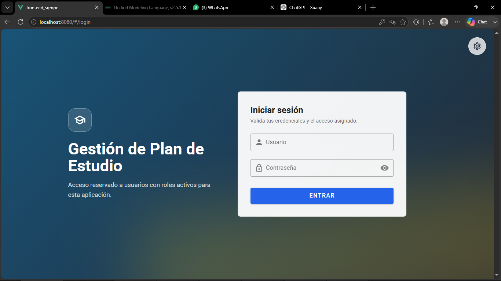
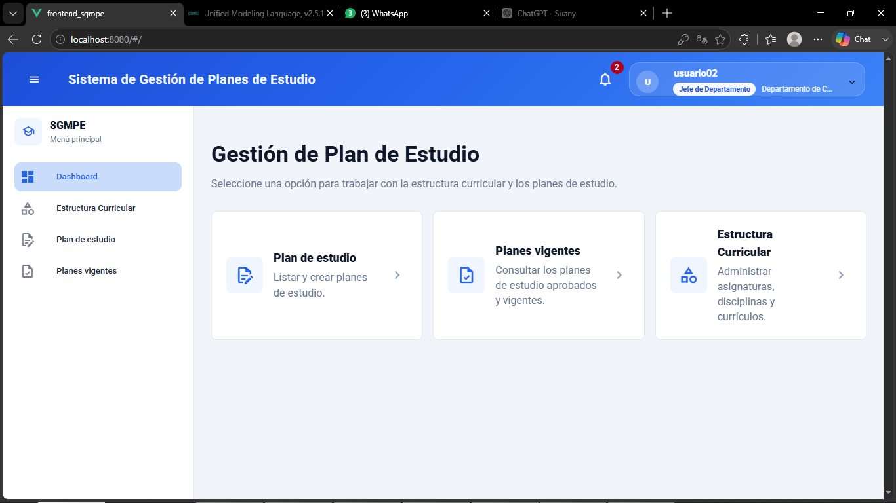
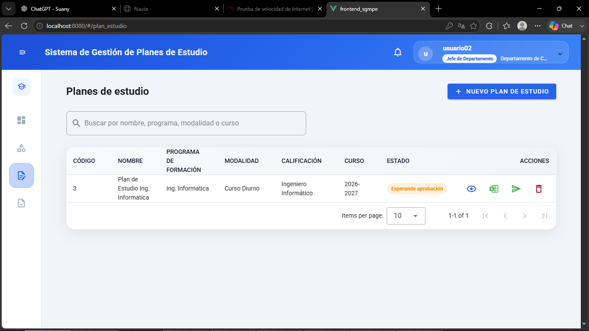
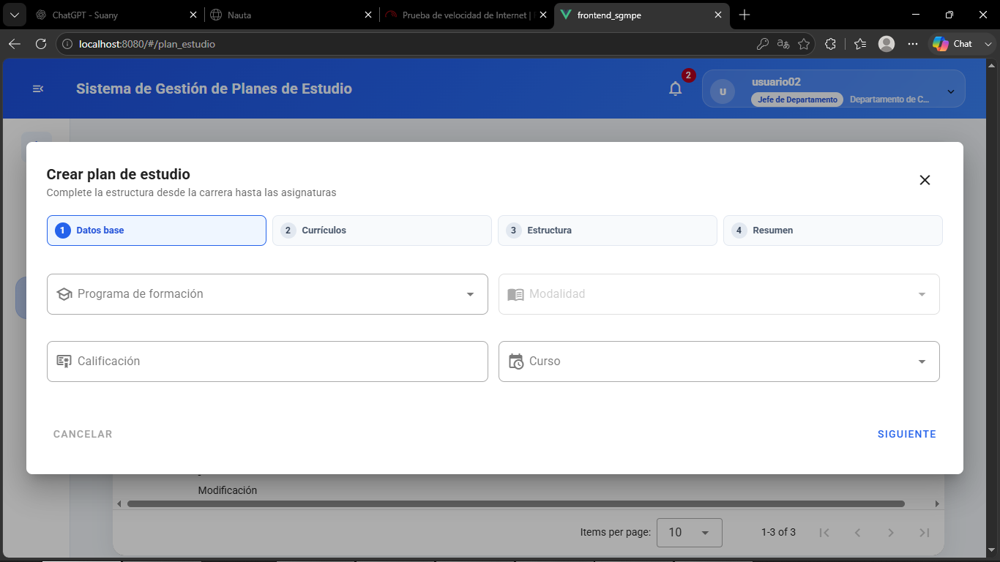
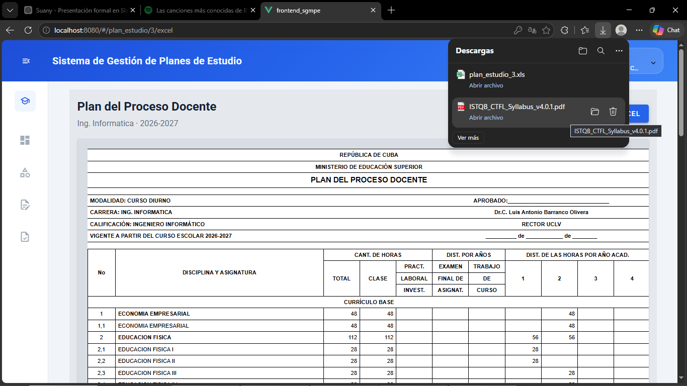
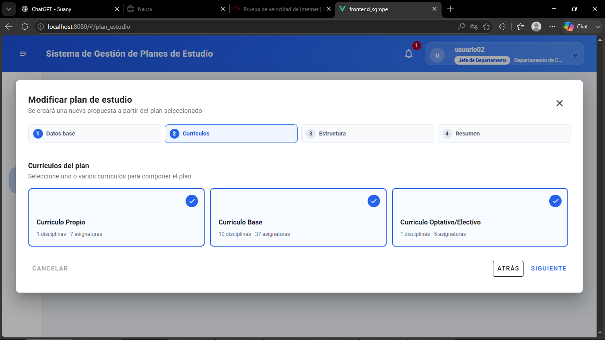
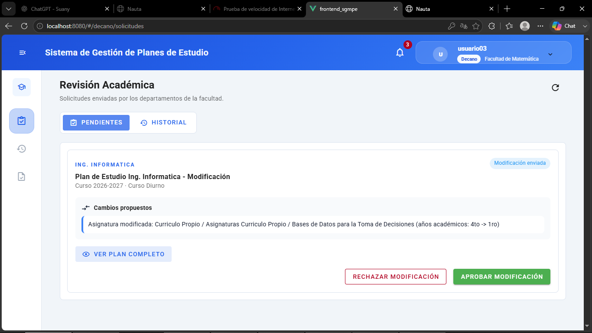
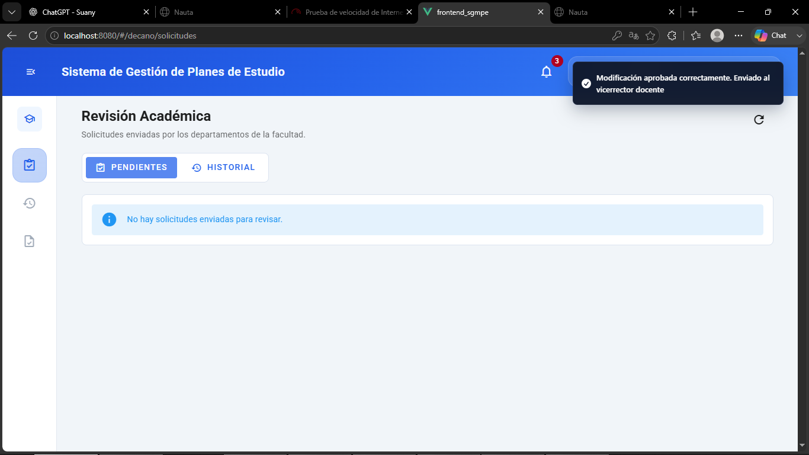
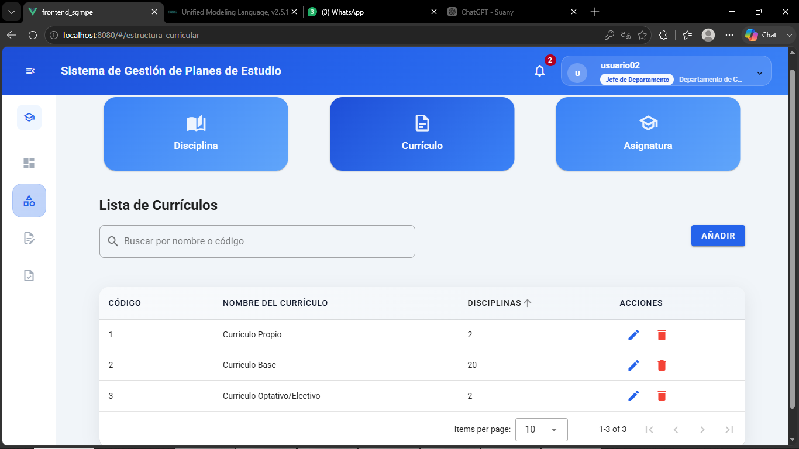
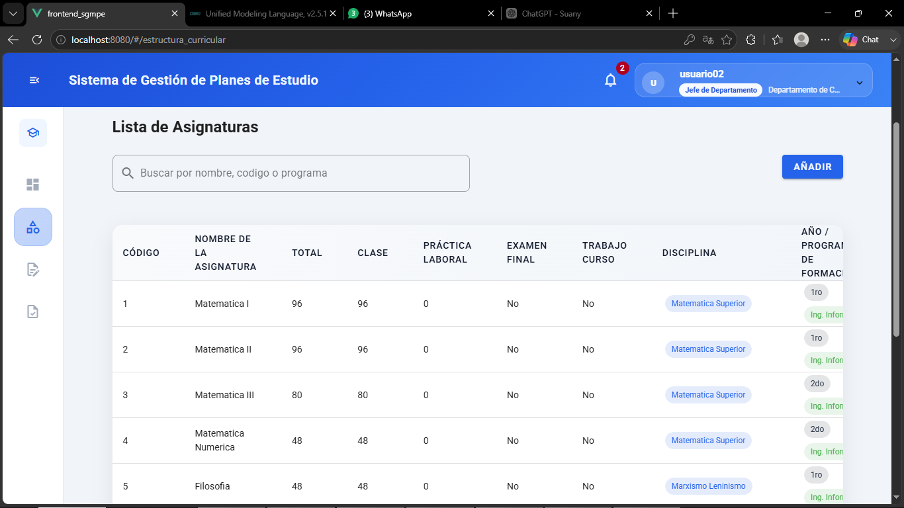

# Study Plan Modification Management System - Frontend


Frontend web application for the **Study Plan Modification Management System**, developed as a Computer Engineering diploma thesis at the **Universidad Central “Marta Abreu” de Las Villas (UCLV)**.

The system supports the digital management of academic study plans, their versions, curriculum structure and modification requests. It was designed to improve the organization, traceability and reliability of the study plan modification process in a university context.

---

## About the Project

The **Study Plan Modification Management System** is a web-based academic management solution focused on supporting the process of modifying study plans at the Universidad Central “Marta Abreu” de Las Villas.

The frontend was developed with **Vue.js** and communicates with a Laravel-based backend through REST services. The application provides user interfaces for consulting study plans, managing curriculum structures, creating modification proposals, reviewing requests and supporting approval workflows.

This project is part of a broader academic management ecosystem that uses shared institutional information such as faculties, departments, careers, curricula, subjects and study plans.

---

## Problem Addressed

The study plan modification process presented several limitations, including:

* Manual entry of academic and administrative data.
* Document dispersion and dependence on external files.
* Lack of a centralized repository for current and previous study plan versions.
* Limited standardization in the generation of documents required for modification requests.
* Difficulty tracking the status and history of modification processes.

The proposed solution helps reduce manual actions, centralize academic information and improve the traceability of study plan modification workflows.

---

## Main Features

### Authentication and Access Control

* User authentication through institutional credentials.
* Role-based access to system functionalities.
* Redirection and interface behavior according to user role.

### Study Plan Management

* Create new study plans.
* Consult current and previous versions of study plans.
* View detailed curriculum structures.
* Identify the status of each study plan.
* Prevent duplicate study plan creation for the same academic context.

### Curriculum Structure Management

* Manage curricula.
* Manage disciplines.
* Manage subjects.
* Manage academic years.
* Calculate general curriculum totals such as class hours, final exams, course work and total hours.

### Study Plan Modification Workflow

* Select a current study plan and generate a modification proposal.
* Modify curriculum elements such as curricula, disciplines, subjects, academic years and hours.
* Save modification proposals.
* Submit modification requests for review.
* Track the status of the request during the approval process.

### Request Review and Approval

* View pending modification requests.
* Review study plan modification details.
* Approve requests according to user role.
* Reject or deny requests when they do not meet academic or institutional criteria.
* Display confirmation messages after each operation.

### Document Generation and Download

* View study plan information in a structured format.
* Generate and download study plan documents in Excel format.

### Internal Notifications

* Display internal notifications related to system actions and request status changes.

---

## User Roles

The system considers several institutional roles involved in the study plan modification process:

* **Administrator:** manages users and role assignments.
* **Head of Department:** creates study plans and submits modification requests.
* **Dean:** reviews and approves modification requests at the faculty level.
* **Vice-Rector for Academic Affairs:** performs higher-level validation and final approval when required.
* **Authorized User:** consults study plan information according to access permissions.

---

## Technologies

### Frontend

* **Vue.js** - JavaScript framework used to build the user interface.
* **JavaScript** - Main programming language for frontend logic.
* **HTML5** - Structure of the web application.
* **CSS3** - Styling and visual layout.
* **Axios** - HTTP client used to consume REST API services.
* **Vue Router** - Client-side routing and navigation.

### Backend Ecosystem

* **Laravel** - Backend framework used for the main REST API.
* **PHP** - Backend programming language.
* **MySQL** - Relational database management system.
* **REST API** - Communication style between frontend and backend.

---

## Architecture Overview

The system follows a **client-server architecture**. The frontend was developed with Vue.js and is responsible for user interaction, interface rendering and consuming backend services.

The backend, implemented with Laravel, manages business logic, data validation, academic entities, users, roles and study plan modification processes. Communication between the frontend and backend is performed through HTTP requests using REST API endpoints.


The frontend uses a component-based organization, allowing reusable views and interface elements for modules such as authentication, study plans, curricula, subjects, disciplines and modification requests.

---

## My Contribution


* Designed and implemented the frontend interface using Vue.js.
* Developed views and components for study plan management.
* Implemented interfaces for creating new study plans.
* Implemented views for consulting current and previous study plan versions.
* Developed the workflow for modifying current study plans.
* Integrated the frontend with the shared Laravel backend API using Axios.
* Implemented role-based user workflows for the main actors involved in the process.
* Developed interfaces for pending modification requests.
* Implemented approval and rejection workflows for validators.
* Added visual feedback through confirmation and validation messages.
* Integrated Excel document visualization and download functionality from the user interface.
* Participated in functional testing using black-box test cases.
* Documented the system behavior as part of the diploma thesis and user manual.

---

## Screenshots


### Authentication



### Main Dashboard



### Study Plan List and Versions



### Create Study Plan



### Study Plan Excel View and Download



### Modify Current Study Plan



### Pending Requests



### Approval Workflow



### Curriculum Management



### Subject Management



---


Main folders:

* `components/`: reusable Vue components.
* `views/`: main system views and pages.
* `router/`: route definitions and navigation control.
* `services/`: API communication logic using Axios.
* `assets/`: static resources used by the interface.
* `screenshots/`: images used to document the project in this README.

---

## Getting Started

### Prerequisites

Make sure you have installed:

* Node.js
* npm
* Git
* Access to the backend API required by the system

### Installation

Clone the repository:

```bash
git clone https://github.com/Sunaymg04/study-plan-management-frontend.git
```

Enter the project folder:

```bash
cd frontend_sgmpe
```

Install dependencies:

```bash
npm install
```

Run the development server:

```bash
npm run serve
```

Build for production:

```bash
npm run build
```

Run linting, if configured:

```bash
npm run lint
```

---

## Backend Configuration

The frontend consumes REST services from the backend API. During local development, the system was tested using:

```text
Main API:  http://localhost:8000/api
Users API: http://127.0.0.1:8001/api
```

If the API base URL is defined inside the project, update it according to your local environment before running the application.

---

## Related Repositories

* Backend API: [api-laravel](https://github.com/Sunaymg04/academic-management-api)

---


## Project Status

Academic prototype developed as part of a Informatic Engineering diploma thesis.

The prototype validates the architectural baseline and the main functional workflows of the study plan modification process, including:

* Creation of study plans.
* Consultation of current and previous versions.
* Excel document download.
* Modification of current study plans.
* Approval of modification requests.

---

## Future Work

Possible improvements for future versions include:

* Deployment in a real institutional environment.
* Pilot testing with selected faculties.
* Extended support for scanned document upload.
* Improved notification mechanisms.
* Enhanced review comments and correction workflows.
* Formal usability evaluation with end users.
* Performance testing with concurrent users.
* Additional dashboards for academic indicators and decision-making support.

---

## Author

**Suany Daniela Medina Guevara**
Informatic Engineering Graduate
Universidad Central “Marta Abreu” de Las Villas

Diploma thesis: **Study Plan Modification Management System for UCLV Careers**

---

## Academic Context

This project was developed as a diploma thesis in Informatic Engineering. It contributes to the digital transformation of academic management processes by providing a functional prototype for the management of study plan modification workflows in a higher education institution.
